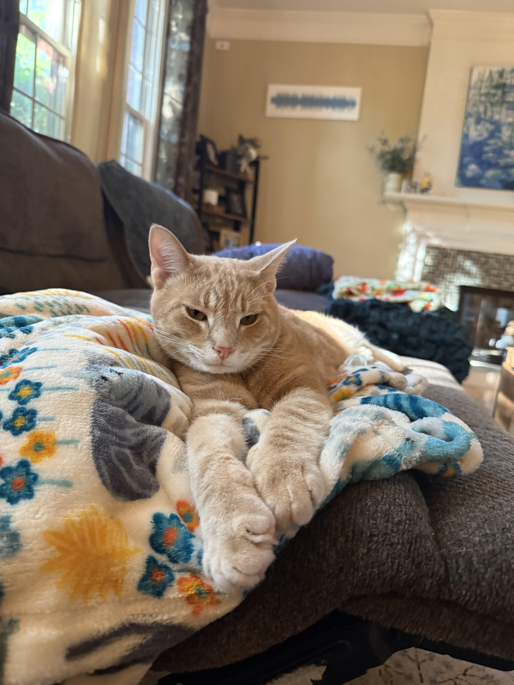
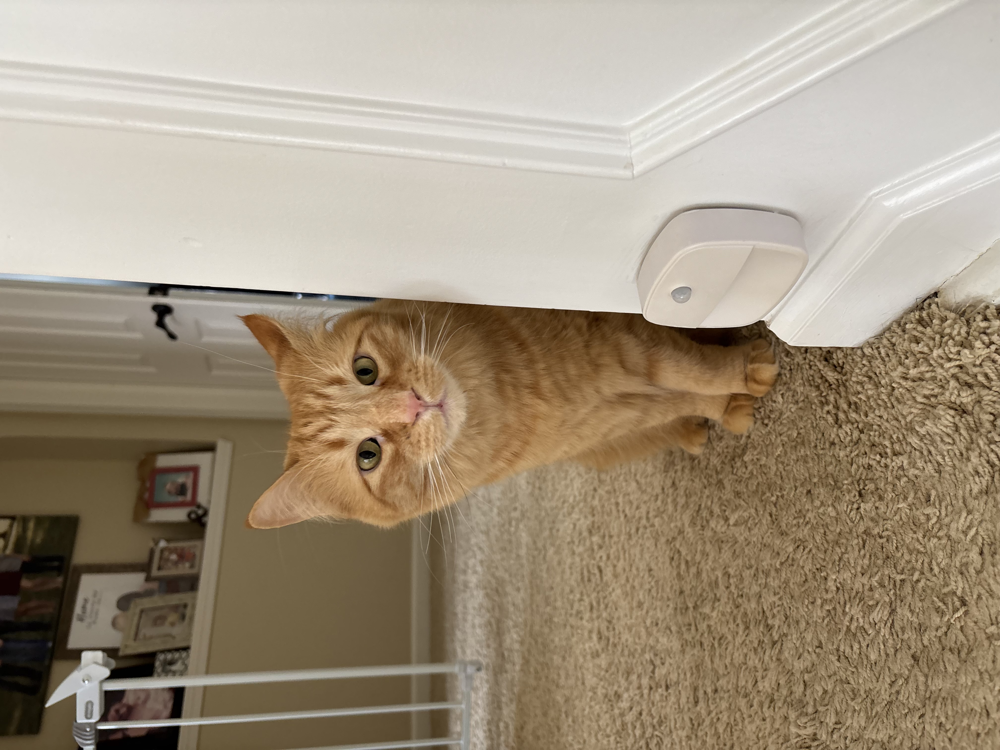
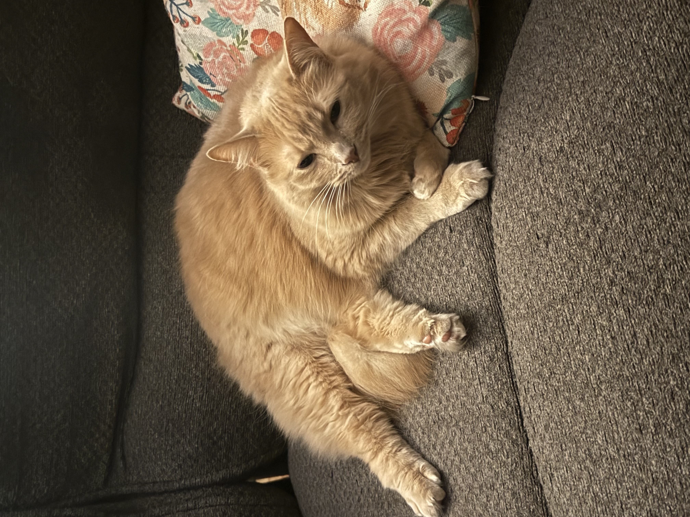
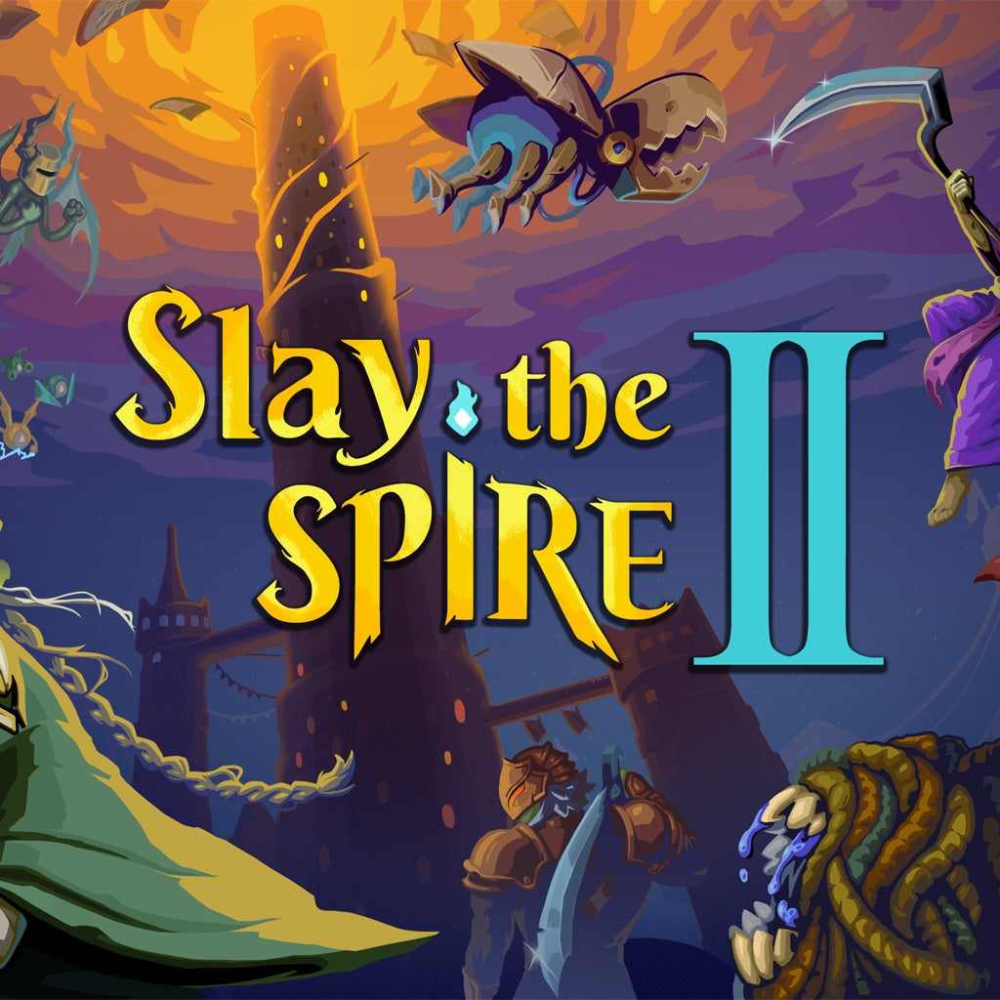
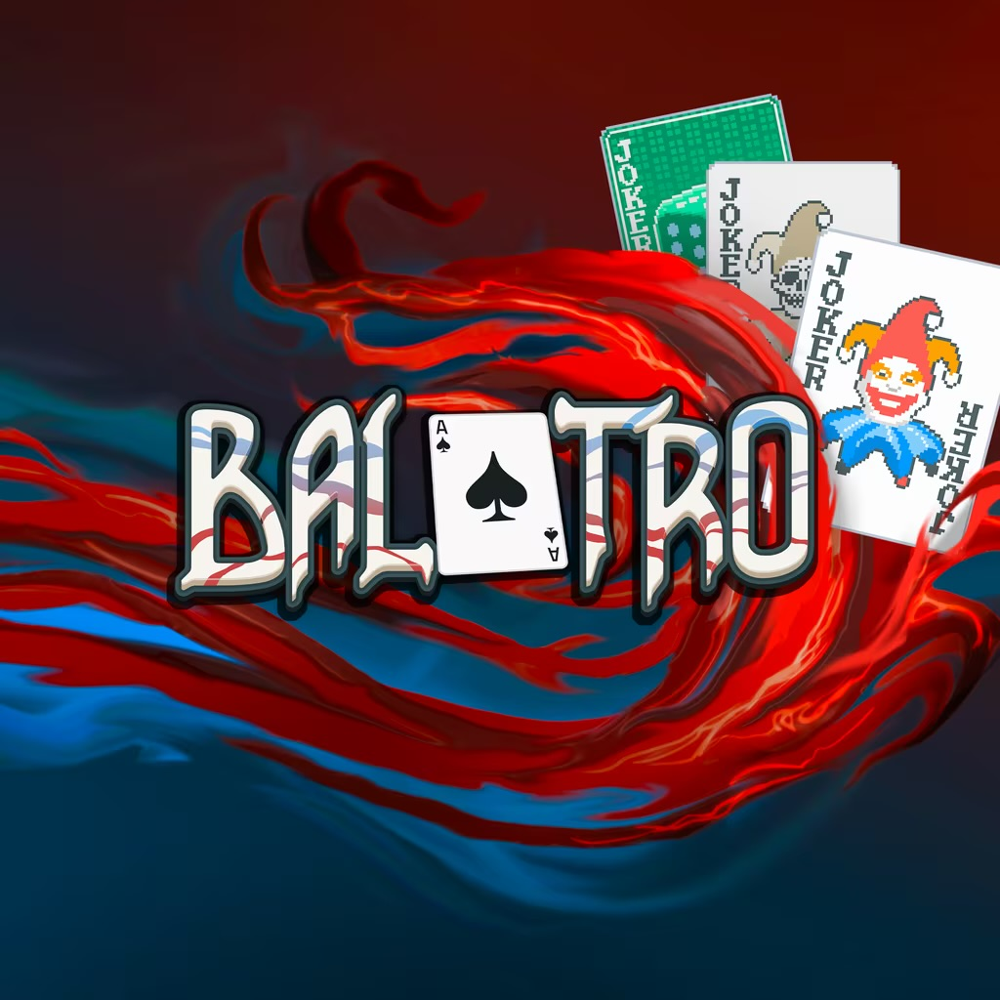
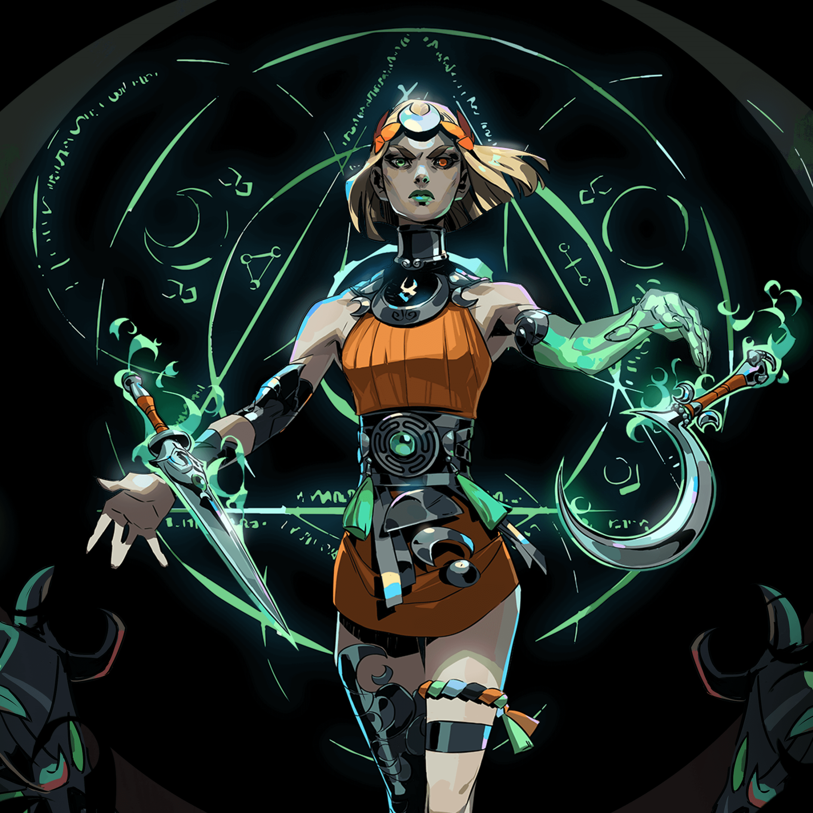

<head>
<link rel="stylesheet" href="style.css"/>
<head>

<body style="background-color: FloralWhite;">

<h1>Bio:</h1>

18 year old game design student specializing in art, but interested in coding. I own 3 orange cats and love video games (who coulda guessed?). Interested in all things media and art, but you could get me to read a few books.
 
 

<h1>Roguelikes:</h1>

<h2>What is a Roguelike?</h2>

A Roguelike is a genre of videogames that is defined by the randomization of each run, you begin a game, go in, die, and do it all again with slight differences in the world around you or items you can find. It's one of the hottest current genres being pushed out largely by indie studios in the last few years. It's marked by the idea of 'runs' and metaprogress throughout the games, giving the player a reason to keep playing and push forward.

<h2>Good VS Bad Roguelikes</h2>

A good Roguelike will make you feel like your playing chess, thinking of future options, possibilities, synergies, and fights, all to build you to the climax of the game. The repetition is fun and rewarding, rather than frustrating and grating. Players in a good roguelike are more likely to.

<h2>Essential Mechanics of a Good Roguelike</h2>

-Procedural Generation
 -High stakes combat
 -Makes losing a learning experience
 -Meaningful Metaprogression
 -Sustaining Replayability
 -Skill outweighs luck
 

<h1>My Top 3 Roguelikes</h1>

  

    <h3>Slay The Spire 2</h3>
   

  

    <h3>Balatro</h3>
     

  

   <h3>Hades II</h3>
      

